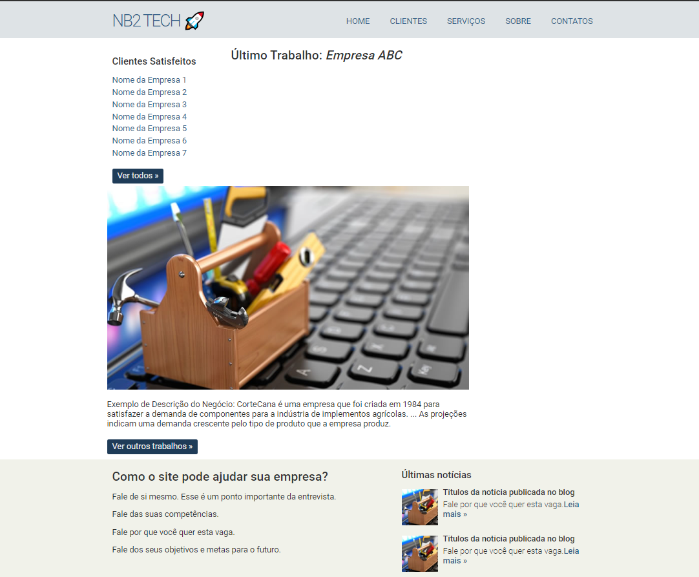

  

## 🚀 Tecnologias

Esse projeto foi desenvolvido com as seguintes tecnologias:

- HTML
- CSS

## 💻 Projeto

Este projeto tem como finalidade treinar e colocar em prática as tecnlogias acima citadas. Habilidades adquiridas no curso do professor Ricardo em seu canal no youtube [RBTech](https://www.youtube.com/watch?v=iZ1ucWosOww&list=PLInBAd9OZCzydDFvm06EgbPXYylGVcyIL)  🚀💻